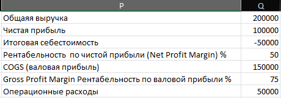

# OzonReportX

Инструмент для генерации ежемесячного отчёта по продажам на Ozon (FBO/FBS) с расчётом ключевых бизнес-метрик: выручка, прибыль, себестоимость и маржинальность.



---

## 🚀 Быстрый старт (Windows)

1. Скачайте проект и распакуйте.
2. Запустите **OzonReportX.bat** двойным кликом.
3. Введите **OZON_CLIENT_ID** и **OZON_API_KEY** из кабинета продавца.

### 🔑 Как получить OZON_CLIENT_ID и OZON_API_KEY

1. Перейдите в личный кабинет продавца Ozon:  
   👉 https://seller.ozon.ru/app/settings/api-keys

2. Нажмите **Сгенерировать ключ**

3. Выберите роли: Posting FBS read-only, Product read-only, Returns read-only, Report, Posting FBO


4. Введите любое имя (например, `report-script`) и подтвердите создание.

5. Скопируйте выданные значения:
   - **Client ID**
   - **API Key**
⚠️ Важно: Ozon показывает API Key только один раз.
Если вы закрыли окно — создайте новый ключ.

6. Вставьте их в программу при запросе:

   ```bash
   OZON_CLIENT_ID=ВАШ_CLIENT_ID
   OZON_API_KEY=ВАШ_API_KEY
   ```

### 📢 Настройка Performance API (опционально, для данных о кампаниях)

Для автоматического получения данных о рекламных кампаниях Ozon:

1. Перейдите в настройки Performance API:  
   👉 https://seller.ozon.ru/app/performance/settings/api

2. Создайте API ключ для Performance API

3. Добавьте в `.env` файл (или введите при запросе программы):
   ```bash
   OZON_PERF_CLIENT_ID=ВАШ_CLIENT_ID@advertising.performance.ozon.ru
   OZON_PERF_API_KEY=ВАШ_CLIENT_SECRET
   ```

⚠️ **Важно:** 
- `OZON_PERF_CLIENT_ID` должен быть в формате `XXXXX-XXXXX@advertising.performance.ozon.ru`
- `OZON_PERF_API_KEY` — это `client_secret`, а не готовый токен
- Если Performance API не настроен, программа запросит затраты на продвижение вручную

4. Укажите себестоимость товаров в созданном файле **costs.xlsx**.

5. После завершения появится Excel-отчёт в папке **reports** — например `Октябрь 2025.xlsx`.

---

## 🧩 Что делает программа

- Загружает заказы **FBO** и **FBS** за указанный месяц.  
- Подставляет себестоимость из `costs.xlsx` или `costs.csv`.  
- Получает данные об активных рекламных кампаниях Ozon (если настроен Performance API).  
- Считает прибыль и основные показатели прямо в файле Excel.  
- Создаёт несколько листов в отчёте: **Заказы** и **Кампании**.  
- Сохраняет результат в папку `reports`.

### 🧮 Логика расчёта столбцов

| Столбец | Что означает | Как рассчитывается |
|----------|---------------|--------------------|
| **Статус** | Текущий статус заказа (доставлен, отменён и т.п.) | Берётся напрямую из API Ozon (`status`). |
| **Номер заказа** | Уникальный идентификатор отправления | `posting_number` из API. |
| **Название товара** | Наименование первой позиции в заказе | `name` из блока `products`. |
| **Артикул** | Артикулы (offer_id) всех товаров в заказе | Собираются без повторов через запятую. |
| **Количество шт.** | Общее число единиц товара в заказе | Сумма `quantity` всех позиций. |
| **Цена продажи** | Начисление за продажу товара | Поле `accruals_for_sale` из финансовых транзакций. |
| **Комиссия за продажу Ozon** | Размер удержанной комиссии | Поле `sale_commission` из транзакций. |
| **Логистика (включает операционные ошибки)** | Расходы на доставку и возвраты | Вычисляется как `- amount + price + sale_commission`. |
| **Сумма начисления** | Итоговое начисление от Ozon | Поле `amount` из финансовых транзакций. |
| **Себестоимость** | Закупочная цена товара | Подставляется из `costs.xlsx`/`costs.csv` по `offer_id`. При отмене заказа = 0. |
| **Прибыль** | Чистая прибыль по заказу | `amount + себестоимость` (т.е. начисление минус себестоимость). |
| **Дата отгрузки** | Дата фактической отправки | `shipment_date` для FBS, `in_process_at` или другие поля для FBO. |
| **Схема** | Тип исполнения заказа | `FBO` или `FBS`, добавляется при сборе данных. |

> После формирования таблицы в Excel дополнительно рассчитываются итоговые показатели:  
> **Выручка**, **чистая прибыль**, **итоговая себестоимость**, **рентабельность (Net Profit Margin, Gross Profit Margin)**, **операционные расходы**, **Продвижение Ozon** и **Внешний маркетинг**.

### 📊 Структура отчёта

Отчёт содержит несколько листов:

1. **Заказы** — основной лист с детальной информацией по каждому заказу
2. **Кампании** — лист с данными об активных рекламных кампаниях Ozon за период (создаётся автоматически, если настроен Performance API)

#### Лист "Кампании"

Содержит следующие показатели по каждой активной кампании:
- ID кампании
- Название кампании
- Состояние
- Тип оплаты и тип объекта
- Бюджеты (общий, дневной, недельный)
- Расход за период
- Показы, клики, CTR
- Средняя цена клика
- Заказы (количество и сумма)
- ДРР (доля рекламных расходов)

---

## ABC&XYZ-анализ

Отчёт ABC&XYZ формируется скриптом `scripts/ABC_XYZ_analytics_report.py`: объединяются месячные отчёты из папки **reports**, по ним считаются ABC (по прибыли) и XYZ (по стабильности спроса по месяцам), результат сохраняется в папку **ABC&XYZ reports** в файл вида `«Ранний месяц год»–«Поздний месяц год».xlsx`.

### Что происходит при построении ABC&XYZ

1. **Выбор файлов и объединение заказов**
   - Берутся Excel-файлы из папки `reports` с именами вида «Месяц Год.xlsx» (например, «Январь 2025.xlsx»).
   - При указании диапазона (`--from-month`, `--from-year`, `--to-month`, `--to-year`) обрабатываются только файлы, попадающие в этот период включительно.
   - С каждого файла читаются только листы **«Заказы»**; листы «Кампании» и прочие не используются.
   - В объединённую таблицу попадают только заказы со статусом **delivered**.
   - В итоговой таблице остаются столбцы: **Артикул**, **Цена продажи**, **Количество шт.**, **Прибыль**, **Дата отгрузки**.

2. **Лист «Заказы»**
   - Итоговая объединённая таблица заказов (delivered) по всем выбранным месяцам.

3. **Лист «ABC» — вклад по прибыли**
   - По каждому артикулу считается **сумма прибыли** за весь период.
   - Артикулы сортируются по убыванию этой суммы.
   - Для каждого артикула считаются:
     - **Доля в общей прибыли** = прибыль артикула / сумма прибыли по всем артикулам;
     - **Накопительная доля** = сумма долей от первого артикула до текущего.
   - **Оценка ABC:**
     - **A** — накопительная доля ≤ 80% (наиболее прибыльные);
     - **B** — накопительная доля ≤ 95%;
     - **C** — остальные.
   - Внизу листа — строка «Общая прибыль» и легенда: A — самые значимые, B — средние, C — наименьшие.

4. **Лист «XYZ» — вклад по стабильности спроса**
   - Строится сводная таблица: **строки = артикулы**, **столбцы = месяцы** (например, «Январь 2025», «Февраль 2025»), **значения = количество доставленных заказов** по этому артикулу в этом месяце (по полю «Дата отгрузки»).
   - Для каждого артикула считается **количество месяцев с продажами > 0**.
   - **Порог регулярности** = `ceil(число_месяцев × 0.8)` — то есть «регулярный» спрос — когда продажи были хотя бы в 80% месяцев (округление вверх: например, при 8 месяцах порог = 7).
   - Артикулы делятся на две группы:
     - **Нерегулярный спрос (Noreg)** — месяцев с продажами меньше порога;
     - **Сглаженный спрос (Reg)** — месяцев с продажами не меньше порога.

   **Нерегулярный спрос (Noreg):**
   - По каждому артикулу считаются **среднее**, **стандартное отклонение** и **коэффициент вариации (CV)** по всем месяцам (включая нули).
   - **Оценка по CV:** X при CV ≤ 0,25; Y при CV ≤ 0,50; иначе Z. При CV = 0 — **«Недостаточно данных»**.

   **Сглаженный спрос (Reg):**
   - По каждому артикулу считается **медиана** помесячных продаж.
   - **Винзоризация:** значения выше «медиана × 2,5» заменяются на это значение (чтобы пики не завышали разброс).
   - В расчёт **среднего и стандартного отклонения** входят только месяцы, где значение **≥ 0,3 × медиана** (пустые и слабые месяцы отбрасываются). В ячейках используется исходное значение или винзоризованное, если была замена.
   - **CV** = σ / среднее; при среднем = 0 или отсутствии подходящих месяцев — «Недостаточно данных».
   - **Оценка по CV:** X при CV ≤ 0,20; Y1 при CV ≤ 0,35; Y2 при CV ≤ 0,50; Y3 при CV > 0,50. При CV = 0 — **«Недостаточно данных»**.
   - В таблице выводятся колонки по каждому месяцу и колонки **«Винз. &lt;месяц&gt;»** (например, «Винз. Январь 2025») — там, где применялась винзоризация.

   На листе XYZ под таблицами выводится **легенда**: Класс (X, Y1, Y2, Y3, Z) | Характеристика | Управленческие рекомендации (стабильный/слабые колебания/сезонность/нерегулярный спрос и т.п.).

5. **Лист «Итог»**
   - Для каждого артикула сводятся оценка по **ABC** и оценка по **XYZ**.
   - **Общая оценка ABCXYZ** = пара «оценка ABC» + «оценка XYZ» (например, AX, AY1, BZ, CZ). Если по XYZ стоит «Недостаточно данных», общая оценка тоже **«Недостаточно данных»**.
   - Список артикулов сортируется так: сначала по ABC (A → B → C), затем по XYZ (X → Y1 → Y2 → Y3 → Y → Z → «Недостаточно данных»). В начале — наиболее ценные и предсказуемые (AX), в конце — наименее ценные и нерегулярные (CZ) или без данных.
   - Ниже таблицы — **легенда** с кодами (AX, AY1, …, CZ), краткой интерпретацией и управленческими рекомендациями для каждой комбинации.

### Запуск ABC&XYZ

```bash
python scripts/ABC_XYZ_analytics_report.py
```

При интерактивном запуске можно указать папку с отчётами и диапазон месяцев. Через аргументы командной строки:

- `--input_dir` — папка с месячными отчётами (по умолчанию `reports`);
- `--output_dir` — папка для результата (по умолчанию `ABC&XYZ reports`);
- `--from-month`, `--from-year`, `--to-month`, `--to-year` — границы периода (включительно); обрабатываются только файлы «Месяц Год.xlsx» из этого диапазона.

---

## 2) Ручная установка

Рекомендуется использовать изолированное окружение.

```bash
# (опционально) создание и активация виртуального окружения
python -m venv .venv
.venv\\Scripts\\activate  # Windows PowerShell / CMD

# установка зависимостей
pip install -U requests pandas openpyxl python-dateutil python-dotenv
```

## 3) Настройка переменных окружения

Секретные данные вынесены в переменные окружения. Создайте файл `.env` в корне проекта и укажите свои значения:

Пример `.env`:

```bash
# Обязательные для работы с заказами
OZON_CLIENT_ID=ВАШ_CLIENT_ID
OZON_API_KEY=ВАШ_API_KEY

# Опциональные, для автоматического получения данных о кампаниях
OZON_PERF_CLIENT_ID=XXXXX-XXXXX@advertising.performance.ozon.ru
OZON_PERF_API_KEY=ВАШ_CLIENT_SECRET
```

[Где взять ключи?](### 🔑 Как получить OZON_CLIENT_ID и OZON_API_KEY)

Примечания безопасности:
- Файл `.env` уже добавлен в `.gitignore` и не попадёт в репозиторий.
- Никогда не коммитьте реальные ключи в код/историю.

## 4) Запуск отчёта

```bash
python scripts/Monthly_sales_report.py
```

Скрипт:
- Запрашивает месяц и год для отчёта
- Получает заказы FBS и FBO за указанный период
- Получает данные об активных рекламных кампаниях Ozon (если настроен Performance API)
- Выгружает Excel с несколькими листами: **Заказы** и **Кампании**
- Считает бизнес‑показатели на листе (выручка, чистая прибыль, себестоимость, маржинальность и т.д.)
- Запрашивает затраты на продвижение Ozon (если не получены из API) и внешний маркетинг

Имена файлов:
- Файл отчёта создаётся автоматически в папке `reports` как `<Месяц> <Год>.xlsx`, например: `Октябрь 2025.xlsx`

Листы в отчёте:
- **Заказы** — основной лист с детальной информацией по заказам
- **Кампании** — лист с данными о рекламных кампаниях (создаётся автоматически, если настроен Performance API)

## 6) Себестоимость

Чтобы пользователи могли задавать себестоимость без изменения скрипта, используйте внешний файл в корне проекта:

- `costs.xlsx` (рекомендуется) или `costs.csv`

Поддерживаемые столбцы (названия можно выбрать из перечисленных, регистр не важен):

- Ключ товара: `prefix` / `префикс` / `код` / `артикул` / `offer_id` 
ВАЖНО: программа работает с вашем внутренним артикулом товара, который вы вводили при создании товара, а не артикул сгенерированный самим Ozon.
- Себестоимость: `cost` / `себестоимость` / `цена` / `стоимость`

Правила сопоставления:
- Если указан точный `offer_id` (артикул) — используется он
- Иначе используется префикс из первых двух символов артикула (если в файле задан префикс)

Пример `costs.xlsx`:

| артикул | себестоимость |
|---------|----------------|
| 11      | 250            |
| 12      | 400            |
| 51      | 500            |


Если файл `costs.xlsx`/`costs.csv` не найден или столбцы не распознаны, скрипт посчитает себестоимость равной 0 и выведет уведомление в консоль.

## 7) Частые проблемы

- Переменные окружения не найдены:
  - Убедитесь, что создан `.env` и заполнены `OZON_CLIENT_ID`, `OZON_API_KEY`
  - Убедитесь, что установлен `python-dotenv`

- Ошибки авторизации 401/403:
  - Проверьте актуальность и права API-ключа в кабинете Ozon
  - Сверьте `Client-Id` и `Api-Key` без лишних пробелов

- Пустые данные за период:
  - Скрипт запрашивает месяц и год. Убедитесь, что заказы в этот период были

- Нет данных о кампаниях:
  - Проверьте, что настроены `OZON_PERF_CLIENT_ID` и `OZON_PERF_API_KEY` в `.env`
  - Убедитесь, что формат `OZON_PERF_CLIENT_ID` правильный: `XXXXX-XXXXX@advertising.performance.ozon.ru`
  - Если Performance API не настроен, программа запросит затраты на продвижение вручную

- Нет даты отгрузки у FBO заказов:
  - Для FBO заказов программа пытается использовать различные поля с датами (`in_process_at`, `shipment_date` и др.)
  - Если дата всё равно отсутствует, возможно API не возвращает это поле для конкретных заказов

## 8) Структура и модификации

- Основная логика в `scripts/Monthly_sales_report.py`
- Работа с Performance API (кампании) в `scripts/performance_api.py`
- Переменные окружения загружаются через `python-dotenv` на старте скрипта
- Период сбора данных запрашивается у пользователя при запуске скрипта

## 9) Автоматическое обновление

Программа поддерживает автоматическое обновление с GitHub. При запуске проверяется наличие новой версии, и если она найдена, пользователю предлагается установить обновление.

**Как это работает:**
- Программа читает версию из файла `version.txt`
- Проверяет последний релиз через GitHub API
- Сравнивает версии и предлагает обновление, если доступна новая версия
- Создаёт резервную копию перед обновлением
- Заменяет файлы (кроме защищённых: `.env`, `costs.xlsx`, `reports` и т.д.)

**Для разработчиков:** Подробная инструкция по созданию релизов находится в файле [RELEASE_GUIDE.md](RELEASE_GUIDE.md)

### Итоговые показатели в отчёте

В колонках P и Q основного листа рассчитываются следующие показатели:

- **Общая выручка** — сумма всех цен продажи
- **Чистая прибыль** — выручка минус себестоимость, комиссии, логистика, продвижение Ozon и внешний маркетинг
- **Итоговая себестоимость** — сумма себестоимости всех товаров
- **Рентабельность по чистой прибыли (Net Profit Margin) %** — (чистая прибыль / выручка) × 100
- **COGS (валовая прибыль)** — выручка + себестоимость
- **Gross Profit Margin (рентабельность по валовой прибыли) %** — (COGS / выручка) × 100
- **Операционные расходы** — COGS - чистая прибыль
- **Продвижение Ozon** — затраты на рекламные кампании Ozon (автоматически из API или ввод вручную)
- **Внешний маркетинг** — затраты на маркетинг вне Ozon (ввод вручную)

⚠️ **Важно:** Затраты на продвижение Ozon и внешний маркетинг вычитаются из чистой прибыли при расчёте итоговых показателей.
