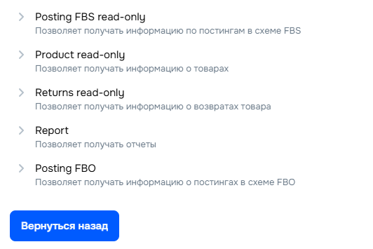

# OzonReportX

Инструмент для генерации ежемесячного отчёта по продажам на Ozon (FBO/FBS) с расчётом ключевых бизнес-метрик: выручка, прибыль, себестоимость и маржинальность.

---

## 🚀 Быстрый старт (Windows)

1. Скачайте проект и распакуйте.
2. Запустите **OzonReportX.bat** двойным кликом.
3. Введите **OZON_CLIENT_ID** и **OZON_API_KEY** из кабинета продавца.

### 🔑 Как получить OZON_CLIENT_ID и OZON_API_KEY

1. Перейдите в личный кабинет продавца Ozon:  
   👉 https://seller.ozon.ru/app/settings/api-keys

2. Нажмите **Сгенерировать ключ**

3. Выберите роли: Posting FBS read-only, Product read-only, Returns read-only, Report, Posting FBO


4. Введите любое имя (например, `report-script`) и подтвердите создание.

5. Скопируйте выданные значения:
   - **Client ID**
   - **API Key**
⚠️ Важно: Ozon показывает API Key только один раз.
Если вы закрыли окно — создайте новый ключ.

6. Вставьте их в программу при запросе:

   ```bash
   OZON_CLIENT_ID=ВАШ_CLIENT_ID
   OZON_API_KEY=ВАШ_API_KEY

4. Укажите себестоимость товаров в созданном файле **costs.xlsx**.

5. После завершения появится Excel-отчёт в папке **reports** — например `Октябрь 2025.xlsx`.

---

## 🧩 Что делает программа

- Загружает заказы **FBO** и **FBS** за прошлый календарный месяц.  
- Подставляет себестоимость из `costs.xlsx` или `costs.csv`.  
- Считает прибыль и основные показатели прямо в файле Excel.  
- Сохраняет результат в папку `reports`.

### 🧮 Логика расчёта столбцов

| Столбец | Что означает | Как рассчитывается |
|----------|---------------|--------------------|
| **Статус** | Текущий статус заказа (доставлен, отменён и т.п.) | Берётся напрямую из API Ozon (`status`). |
| **Номер заказа** | Уникальный идентификатор отправления | `posting_number` из API. |
| **Название товара** | Наименование первой позиции в заказе | `name` из блока `products`. |
| **Артикул** | Артикулы (offer_id) всех товаров в заказе | Собираются без повторов через запятую. |
| **Количество шт.** | Общее число единиц товара в заказе | Сумма `quantity` всех позиций. |
| **Цена продажи** | Начисление за продажу товара | Поле `accruals_for_sale` из финансовых транзакций. |
| **Комиссия за продажу Ozon** | Размер удержанной комиссии | Поле `sale_commission` из транзакций. |
| **Логистика (включает операционные ошибки)** | Расходы на доставку и возвраты | Вычисляется как `- amount + price + sale_commission`. |
| **Сумма начисления** | Итоговое начисление от Ozon | Поле `amount` из финансовых транзакций. |
| **Себестоимость** | Закупочная цена товара | Подставляется из `costs.xlsx`/`costs.csv` по `offer_id`. При отмене заказа = 0. |
| **Прибыль** | Чистая прибыль по заказу | `amount + себестоимость` (т.е. начисление минус себестоимость). |
| **Дата отгрузки** | Дата фактической отправки | `shipment_date` из API. |
| **Схема** | Тип исполнения заказа | `FBO` или `FBS`, добавляется при сборе данных. |

> После формирования таблицы в Excel дополнительно рассчитываются итоговые показатели:  
> **Выручка**, **чистая прибыль**, **итоговая себестоимость**, **рентабельность (Net Profit Margin, Gross Profit Margin)** и **операционные расходы**.

---

## 2) Ручная установка

Рекомендуется использовать изолированное окружение.

```bash
# (опционально) создание и активация виртуального окружения
python -m venv .venv
.venv\\Scripts\\activate  # Windows PowerShell / CMD

# установка зависимостей
pip install -U requests pandas openpyxl python-dateutil python-dotenv
```

## 3) Настройка переменных окружения

Секретные данные вынесены в переменные окружения. Создайте файл `.env` в корне проекта и укажите свои значения:

Пример `.env`:

```bash
OZON_CLIENT_ID=ВАШ_CLIENT_ID
OZON_API_KEY=ВАШ_API_KEY
```

[Где взять ключи?](### 🔑 Как получить OZON_CLIENT_ID и OZON_API_KEY)

Примечания безопасности:
- Файл `.env` уже добавлен в `.gitignore` и не попадёт в репозиторий.
- Никогда не коммитьте реальные ключи в код/историю.

## 4) Запуск отчёта

```bash
python scripts/Monthly_sales_report.py
```

Скрипт:
- Получает заказы FBS и FBO за прошлый календарный месяц
- Выгружает Excel с деталями и расчётными полями
- Считает бизнес‑показатели на листе (выручка, чистая прибыль, себестоимость, маржинальность и т.д.)

Имена файлов:
- Файл отчёта создаётся автоматически в папке `reports` как `<Месяц> <Год>.xlsx`, например: `Октябрь 2025.xlsx`

## 6) Себестоимость

Чтобы пользователи могли задавать себестоимость без изменения скрипта, используйте внешний файл в корне проекта:

- `costs.xlsx` (рекомендуется) или `costs.csv`

Поддерживаемые столбцы (названия можно выбрать из перечисленных, регистр не важен):

- Ключ товара: `prefix` / `префикс` / `код` / `артикул` / `offer_id` 
ВАЖНО: программа работает с вашем внутренним артикулом товара, который вы вводили при создании товара, а не артикул сгенерированный самим Ozon.
- Себестоимость: `cost` / `себестоимость` / `цена` / `стоимость`

Правила сопоставления:
- Если указан точный `offer_id` (артикул) — используется он
- Иначе используется префикс из первых двух символов артикула (если в файле задан префикс)

Пример `costs.xlsx`:

| артикул | себестоимость |
|---------|----------------|
| 11      | 250            |
| 12      | 400            |
| 51      | 500            |


Если файл `costs.xlsx`/`costs.csv` не найден или столбцы не распознаны, скрипт посчитает себестоимость равной 0 и выведет уведомление в консоль.

## 7) Частые проблемы

- Переменные окружения не найдены:
  - Убедитесь, что создан `.env` и заполнены `OZON_CLIENT_ID`, `OZON_API_KEY`
  - Убедитесь, что установлен `python-dotenv`

- Ошибки авторизации 401/403:
  - Проверьте актуальность и права API-ключа в кабинете Ozon
  - Сверьте `Client-Id` и `Api-Key` без лишних пробелов

- Пустые данные за период:
  - Скрипт берёт прошлый календарный месяц. Убедитесь, что заказы в этот период были

## 8) Структура и модификации

- Основная логика в `scripts/Monthly_sales_report.py`
- Переменные окружения загружаются через `python-dotenv` на старте скрипта
- При необходимости можно изменить период сбора данных в функциях `get_last_month_date_range`, `get_orders`, `get_fbo_orders`
