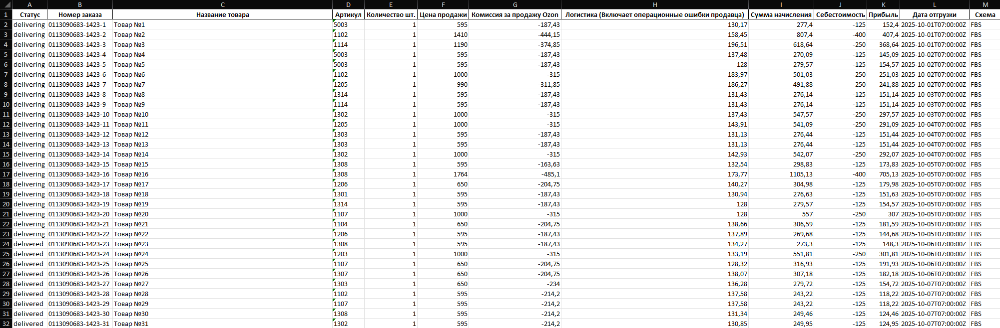
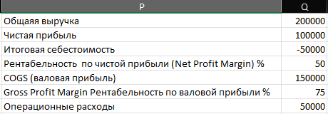

# OzonReportX

Инструмент для работы с данными магазина Ozon: месячные отчёты по продажам, ABC/XYZ-анализ, расчёт FBO-поставок, баланс, управление ценами и акциями.

Текущая версия: **2.1.2**




## Что умеет проект

- Создаёт месячный Excel-отчёт по продажам Ozon за выбранный месяц.
- Объединяет FBO и FBS заказы в один отчёт.
- Подтягивает себестоимость из `costs.xlsx`.
- Считает выручку, прибыль, рентабельность, логистику и бизнес-показатели.
- Добавляет лист `Кампании`, если настроен Performance API.
- Подтягивает расходы по `star_products` из отчёта баланса.
- Добавляет в месячный отчёт показатель `Расход хранения FBO` в `P17/Q17` из поля `product_placement_in_ozon_warehouses`.
- Строит ABC/XYZ-анализ по месячным отчётам из папки `reports`.
- Считает FBO-поставку по данным ABC/XYZ, продажам за 90 дней и остаткам FBO.
- Выгружает отчёт по балансу Ozon в JSON и Excel.
- Управляет ценами и акциями через отдельный раздел:
  - диапазон рентабельности;
  - расчёт оптимальной цены;
  - обновление текущих цен и акций в `costs.xlsx`;
  - удаление невыгодных акций;
  - добавление товаров в акции;
  - обработка заявок на скидку.
- Поддерживает автообновление из GitHub Releases.

Дополнительно в репозитории есть AI-модули `scripts/ai_chat.py` и `scripts/ai_interpreter.py`, но они сейчас не вынесены в главное меню.

## Главное меню

Проект запускается через новый launcher и показывает разделы:

1. `Отчёты`
2. `Цены и акции`
3. `Поставки`
4. `Финансы`
5. `Настройки`
6. `Выход`

На стартовом экране также показывается статус системы:

- настроен ли `OZON_CLIENT_ID`;
- настроен ли `OZON_API_KEY`;
- найден ли `costs.xlsx`;
- сколько готовых месячных отчётов лежит в `reports`;
- настроен ли Performance API.

## Быстрый старт

### Windows

1. Скачайте или распакуйте проект.
2. Запустите `OzonReportX.bat`.
3. При первом запуске программа:
   - создаст `.venv`;
   - установит зависимости;
   - предложит создать `.env`;
   - создаст шаблон `costs.xlsx`, если файла ещё нет.

### Ручной запуск

```powershell
python -m venv .venv
.venv\Scripts\activate
pip install -U pip
pip install requests pandas openpyxl python-dateutil python-dotenv packaging
python scripts\first_run_setup.py
```

## Обязательные переменные окружения

Создайте файл `.env` в корне проекта:

```env
OZON_CLIENT_ID=ВАШ_CLIENT_ID
OZON_API_KEY=ВАШ_API_KEY
```

### Опционально: Performance API

Если хотите автоматически получать данные по рекламным кампаниям:

```env
OZON_PERF_CLIENT_ID=XXXXX-XXXXX@advertising.performance.ozon.ru
OZON_PERF_API_KEY=ВАШ_CLIENT_SECRET
```

Важно:

- `OZON_PERF_CLIENT_ID` должен быть в формате `...@advertising.performance.ozon.ru`
- `OZON_PERF_API_KEY` должен быть именно `client_secret`
- если Performance API не настроен, месячный отчёт всё равно будет создан, но расходы на продвижение Ozon могут запрашиваться вручную

## Как получить Ozon API ключи

1. Откройте кабинет продавца Ozon: [seller.ozon.ru/app/settings/api-keys](https://seller.ozon.ru/app/settings/api-keys)
2. Создайте ключ.
3. Скопируйте:
   - `Client ID`
   - `API Key`

Важно: `API Key` Ozon показывает только один раз.

## Файл себестоимости `costs.xlsx`

Проект использует `costs.xlsx` в корне репозитория. Если файла нет, launcher создаёт шаблон автоматически.

Минимально нужны колонки:

- артикул товара;
- себестоимость.

Поддерживаются разные названия колонок, например:

- ключ товара: `артикул`, `offer_id`, `код`, `префикс`
- себестоимость: `себестоимость`, `cost`, `цена`, `стоимость`

Проект работает с вашим внутренним артикулом товара, который передаётся в Ozon как `offer_id`.

После работы раздела `Цены и акции` файл `costs.xlsx` может автоматически пополняться колонками:

- `Минимальная цена продажи`
- `Желательная цена продажи`
- `Текущая цена на Ozon`
- `Цена с учётом акций и скидок`
- `Текущая ожидаемая рентабельность`
- отдельные колонки по акциям

После действий:

- `Удалить невыгодные акции`
- `Добавить товары в акции`

программа автоматически запускает обновление текущих цен и акций, чтобы `costs.xlsx` оставался актуальным.

## Разделы проекта

### 1. Отчёты

Раздел `Отчёты` в launcher содержит:

1. `Создать месячный отчёт`
2. `Открыть список готовых отчётов`
3. `Построить ABC/XYZ-анализ`

### 2. Цены и акции

Пункт `Цены и акции` сразу открывает внутреннее меню:

1. `Диапазон рентабельности`
2. `Рассчитать оптимальную цену`
3. `Узнать текущие цены и акции`
4. `Удалить невыгодные акции`
5. `Добавить товары в акции`
6. `Обработать заявки на скидку`
0. `Назад в главное меню`

Что важно:

- пункт `Узнать текущие цены и акции` объединяет старые операции получения текущих цен и активных акций;
- при добавлении товаров в акции показывается список кандидатов в формате:

```text
артикул | акция | цена добавления
```

### 3. Поставки

Раздел `Поставки`:

1. `Рассчитать поставку FBO`
2. `Открыть последние отчёты по поставкам`

Логика расчёта:

- берётся ABC/XYZ за последние 3 полных месяца;
- при необходимости ABC/XYZ и недостающие месячные отчёты строятся автоматически;
- дополнительно считаются продажи по дням за 90 дней;
- из Ozon API подтягиваются остатки FBO;
- результат сохраняется в `stocks reports`.

### 4. Финансы

Раздел `Финансы`:

1. `Скачать отчёт по балансу`
2. `Показать последние выгрузки`

Ограничение Ozon API: период выгрузки баланса не более **30 дней**.

### 5. Настройки

Раздел `Настройки`:

1. `Проверить статус системы`
2. `Создать или проверить .env`
3. `Открыть costs.xlsx`
4. `Проверить обновления`

## Месячный отчёт

Скрипт: `scripts/Monthly_sales_report.py`

Запуск:

```powershell
python scripts\Monthly_sales_report.py
```

Или неинтерактивно:

```powershell
python scripts\Monthly_sales_report.py --month 3 --year 2026
```

Что делает:

- загружает FBS и FBO заказы за месяц;
- формирует Excel-отчёт в папке `reports`;
- создаёт лист `Заказы`;
- при наличии рекламных данных создаёт лист `Кампании`;
- считает показатели в блоке P/Q;
- может запросить вручную:
  - затраты на продвижение Ozon;
  - внешний маркетинг.

В блоке показателей дополнительно учитываются:

- `Продвижение Ozon`
- `Внешний маркетинг`
- `Звёздные товары`
- `Расход хранения FBO`

## ABC/XYZ-анализ

Скрипт: `scripts/ABC_XYZ_analytics_report.py`

Запуск:

```powershell
python scripts\ABC_XYZ_analytics_report.py
```

С параметрами:

```powershell
python scripts\ABC_XYZ_analytics_report.py -i reports --output_dir "ABC&XYZ reports" --from-month 1 --from-year 2026 --to-month 3 --to-year 2026
```

Что делает:

- берёт месячные отчёты из `reports`;
- использует лист `Заказы`;
- анализирует только доставленные заказы;
- строит ABC по прибыли;
- строит XYZ по стабильности спроса;
- формирует итоговый Excel в `ABC&XYZ reports`.

## Расчёт поставок FBO

Скрипт: `scripts/fbo_supply_report.py`

Запуск:

```powershell
python scripts\fbo_supply_report.py
```

Результат:

- создаётся файл вида `Расчёт поставок <Месяц> <Год>.xlsx`;
- сохраняется в папку `stocks reports`.

## Баланс

Скрипт: `scripts/balance_report.py`

Запуск:

```powershell
python scripts\balance_report.py
```

Или с параметрами:

```powershell
python scripts\balance_report.py --date_from 2026-03-01 --date_to 2026-03-30
```

Что делает:

- выгружает баланс через `v1/finance/balance`;
- сохраняет JSON и Excel;
- пишет результат в `balance reports`;
- используется также как источник для:
  - `star_products`;
  - `product_placement_in_ozon_warehouses`.

## Основные папки

- `reports` — месячные отчёты
- `ABC&XYZ reports` — отчёты ABC/XYZ
- `stocks reports` — отчёты по поставкам FBO
- `balance reports` — выгрузки баланса
- `scripts` — основная логика проекта
- `img` — изображения для README

## Автообновление

Проект поддерживает автообновление через GitHub Releases.

Как это работает:

- локальная версия читается из `version.txt`;
- последняя версия проверяется через GitHub API `releases/latest`;
- при обновлении сохраняются пользовательские данные, включая:
  - `.env`
  - `costs.xlsx`
  - `costs.csv`
  - `reports`
  - `version.txt`

Если вы выпускаете новую версию проекта, обязательно:

1. обновите `version.txt`;
2. закоммитьте изменение;
3. создайте tag;
4. создайте GitHub Release на этом tag.

## Основные скрипты

- `scripts/first_run_setup.py` — launcher и главное меню
- `scripts/Monthly_sales_report.py` — месячный отчёт
- `scripts/ABC_XYZ_analytics_report.py` — ABC/XYZ
- `scripts/fbo_supply_report.py` — поставки FBO
- `scripts/balance_report.py` — баланс
- `scripts/price_management.py` — меню управления ценами и акциями
- `scripts/recommended_prices.py` — расчёт цен и API-логика по ценам/акциям
- `scripts/update_prices.py` — обновление минимальных цен в Ozon
- `scripts/_auto_update.py` — автообновление

## Частые проблемы

### Не найден `.env`

Проверьте, что в корне есть файл `.env` и в нём заполнены:

- `OZON_CLIENT_ID`
- `OZON_API_KEY`

### Ошибка 401 или 403

Проверьте:

- актуальность API-ключа;
- правильность `Client ID`;
- отсутствие лишних пробелов.

### Не создаётся лист `Кампании`

Проверьте:

- заполнены ли `OZON_PERF_CLIENT_ID` и `OZON_PERF_API_KEY`;
- что `OZON_PERF_CLIENT_ID` имеет корректный формат.

### Пустой или неполный `costs.xlsx`

Проверьте:

- что в файле есть артикулы (`offer_id`);
- что указана себестоимость;
- что названия колонок распознаются.

### Не находится отчёт за прошлый месяц при расчёте цен

Раздел `Цены и акции` использует предыдущий месячный отчёт для расчёта ставок комиссии и логистики. Если файла нет, программа предложит сгенерировать его автоматически.

## Безопасность

- `.env` не должен попадать в git.
- Не коммитьте реальные API-ключи.
- Перед массовыми действиями по акциям и скидкам проверяйте вывод preview.
